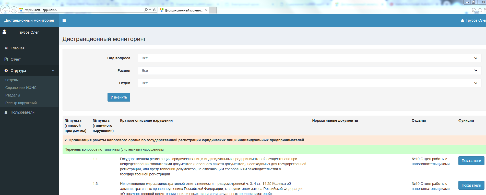
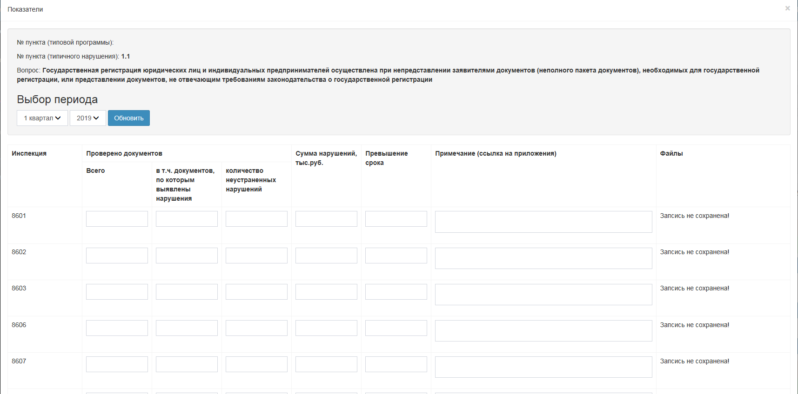
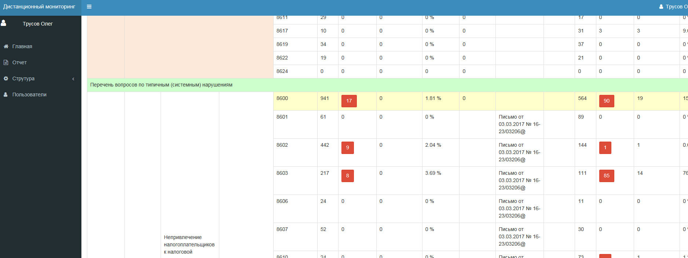

Дистанционный мониторинг
============================

Содержит информацию о типичных и типовых вопросах нарушений в Инспекциях.
Ввод и просмотр информации (формирование отчета) осуществляется на региональном уровне, просмотр информации (формирование отчета) на местном уровне. 


## Основание разработки
Отдел контроля налоговых органов.


## Описание

Структура каталога
-------------------

      assets/             contains assets definition
      commands/           contains console commands (controllers)
      config/             contains application configurations
      controllers/        contains Web controller classes
      mail/               contains view files for e-mails
      models/             contains model classes
      runtime/            contains files generated during runtime
      tests/              contains various tests for the basic application
      vendor/             contains dependent 3rd-party packages
      views/              contains view files for the Web application
      web/                contains the entry script and Web resources


## Установка

Создать файл `config/AD_prarms.php` (настройки для подключения к Active Directory):
```php
return [    
	'server' => 'ldap://server1:389 ldap://server2:389',
	'port' => 389,
	'baseDn' => 'OU=UFNS86,DC=regions,DC=tax,DC=nalog,DC=ru',
	'login' => 'DOMAIN\User',
	'password' => 'Password',
];
```	
где, 

	поле `server` - указать сервера LDAP
	поле `baseDn` - расположение каталога LDAP
	поле 'login' и 'password' - логин и пароль пользвателя для поиска информации в LDAP

Создать файл `config/db.php` (настройки подключения к БД Microsoft SQL Server):
```php
return [
	'class' => 'yii\db\Connection',
	'dsn' => 'sqlsrv:Server=ServerName;Database=DM',		
	'username' => 'usertDb',
	'password' => 'passwordDb',	
	'tablePrefix' => 'dm2_',
];
```
где изменить название сервера, наименование БД и учетную запись для подключения к Microsoft SQL Server.

## Измнения
* 2017 - разработка
* 08.05.2019 - изменение файла `readme.md`

## Скриншоты


